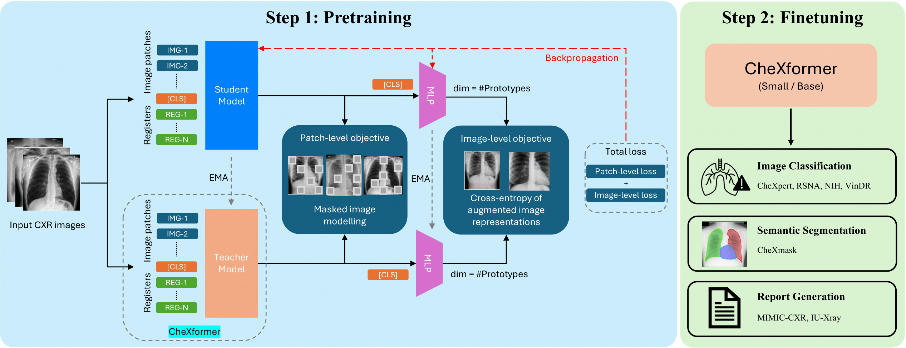

# CXFormer: Scalable Vision Foundation Models for Chest X-rays

 <!-- Placeholder for a banner image -->

**📄 Paper:** [Empirical Analysis of Scaling Vision Foundation Models for Chest X-rays (MIDL 2025)](LINK_TO_PAPER)  
**👨‍⚕️ Authors:** Ahmed Al-Mahrooqi, Prateek Munjal, Ronnie Rajan, Marco AF Pimentel, Praveenkumar Kanithi  
**📍 Affiliation:** M42, Abu Dhabi  
**📦 Models:** [CXFormer(S)](https://huggingface.co/m42-health/CXFormer-small), [CXFormer(B)](https://huggingface.co/m42-health/CXFormer-base)
**🧠 Base Architecture:** Vision Transformers (ViT-S, ViT-B)  
**📊 Tasks:** Image Classification, Semantic Segmentation, Report Generation

---

## 🔬 Overview

**CXFormer** is a self-supervised foundation model family tailored for **Chest X-ray (CXR)** analysis. Built on top of DINOv2 and adapted with domain-specific optimizations, CXFormer delivers **SOTA** performance on multiple medical imaging tasks while being compute-efficient.

Key Contributions:
- Register-enhanced ViT with fewer prototype heads
- Self-supervised pretraining on 600K+ CXRs from 5 global datasets
- Strong generalization across 3 core tasks: classification, segmentation, and report generation
- Lightweight CXFormer(S) matches RAD-DINO with 7× less compute
- Released on HuggingFace and open-sourced for reproducibility

---

## 📦 Model Checkpoints

| Model      | Params | Pretrain Compute (FLOPs) | Mean AUROC | HuggingFace Model Card |
|------------|--------|---------------------------|-------------|-------------------------|
| CXFormer(S)  | 22M    | 3.63 ExaFLOPs             | 86.05%      | [Huggingface Link](https://huggingface.co/m42-health/CXFormer-small)|
| CXFormer(B)  | 87M    | 14.42 ExaFLOPs            | **87.93%**  | [Huggingface Link](https://huggingface.co/m42-health/CXFormer-base) |

> 📌 Note: Both models are trained solely on image data—no text supervision.

---

## 🧪 Datasets

### Pretraining
- CheXpert
- MIMIC-CXR
- PadChest
- NIH-CXR8
- BRAX

### Downstream Tasks
| Task                | Dataset(s)                        |
|---------------------|-----------------------------------|
| Image Classification| CheXpert, NIH-CXR8, RSNA, VinDr   |
| Segmentation        | CheXmask                          |
| Report Generation   | MIMIC-CXR, IU-Xray                |

---

## 🚀 Getting Started

### 🔧 Installation

```bash
git clone https://github.com/m42-health/CXFormer.git
cd CXFormer
pip install -r requirements.txt
```

---

### 🏋️‍♀️ Continual Pretraining from DINOv2

```bash
sh scripts/pretrain/cxformer_slurm_submitit.sh
```
<details>
  <summary><i>This script internally runs the following:</i></summary>

```bash
export PYTORCH_CUDA_ALLOC_CONF=max_split_size_mb:256 # to reduce fragmentation

n_nodes=1

cfg_file=dinov2/configs/pretrain/chexformer_small.yaml

PYTHONPATH=. python dinov2/run/train/train.py \
--nodes $n_nodes \
--nodelist "worker-13" \
--config-file $cfg_file \
--output-dir output_ablations_new/pretrain/chexformer_small_slurm/
```
</details>

---

### 🎯 Fine-Tuning on Downstream Tasks

You can fine-tune **CXFormer** on downstream image classification tasks such as **CheXpert** using the provided shell script.

#### 🚀 Run Image classification finetuning (CheXpert Dataset)

```bash
sh scripts/finetuning/image_classification/ft_CXFormer_chexpert.sh
```
<details>
  <summary><i>This script internally runs the following:</i></summary>

```bash
export CUDA_VISIBLE_DEVICES=0
n_epochs=100
pretrained_wt="m42-health/CXFormer-small"

PYTHONPATH=. deepspeed dinov2/train/cxr_finetune.py \
  --config-file dinov2/configs/downstream/classification/CXFormer_chexpert_small.yaml \
  --output-dir output_ablations_new/finetune/CXFormer_chexpert \
  --exp-name ft_CXFormer \
  --pretrained-weights $pretrained_wt \
  --model-type dinov2 \
  --num-epochs $n_epochs \
  --batch-size 10 \
  --num_workers 1 \
  --seed 7479 \
  --cls-n-layers 4 \
  --apply-avgpool \
  --clf_lr 5e-5 \
  --backbone_lr 5e-7
```

📁 Output
The fine-tuned model, logs, and metrics will be saved in:
```
output_ablations_new/finetune/CXFormer_chexpert/
```
</details>

#### 🚀 Run Image Segmentation finetuning (Mimic ChexMask Dataset)

```bash
sh scripts/finetuning/segmentation/cxformer_chexmask.sh
```

#### 🚀 For radiology report generation
We refer interested readers to llava repo as we straightaway used it in our work.

<!-- ```bash
# # Report generation
# python train_finetune.py --task report_generation --config configs/mimic_cxr_report.yaml
``` -->

---

## 📈 Results Summary

### 🩻 Classification (AUROC)
| Model       | CheXpert | RSNA | NIH-CXR8 | VinDr | Avg. |
|-------------|----------|------|----------|-------|------|
| CXFormer(S)   | 83.34    | 91.13| 83.68    | 46.03 (AUPRC) | 86.05 |
| **CXFormer(B)** | **86.80** | **91.71** | **85.28** | **48.02 (AUPRC)** | **87.93** |

### 🫁 Segmentation (Dice Score)
| Model       | Lungs | Heart | Avg. |
|-------------|-------|-------|------|
| CXFormer(S)   | 91.69 | 89.35 | 90.52 |
| **CXFormer(B)** | 91.94 | 89.94 | 90.94 |

### 📄 Report Generation (MIMIC-CXR)
| Model       | ROUGE-L | BLEU-4 | RGER | F1-14 | Avg. |
|-------------|----------|--------|------|--------|-------|
| **CXFormer(S)** | **25.25** | **9.11** | **23.06** | 33.85 | 27.51 |
| CXFormer(B)   | 24.93   | 9.03   | 22.94 | 33.45 | 27.16 |

---

## 🗂 Repo Structure

```
CXFormer/
├── configs/                              # YAML configuration files
├── models/                               # Vision backbone encoders and heads
├── dinov2/
│   ├── data/                             # Data loading utilities
│   ├── cxr_data/                         # Custom dataset classes and preprocessing logic for chest X-rays
│   └── train/
│       ├── cxr_pretrain.py              # Pretraining script
│       ├── cxr_finetune.py              # Finetuning script for image classification
│       └── cxr_segmentation.py          # Finetuning script for image segmentation
└── README.md                            # Project overview
```

---

## 📜 Citation

```bibtex
@inproceedings{CXFormer_2025,
  title={Empirical Analysis of Scaling Vision Foundation Models for Chest X-rays},
  author={Al-Mahrooqi, Ahmed and Munjal, Prateek and Rajan, Ronnie and Pimentel, Marco AF and Kanithi, Praveenkumar},
  booktitle={Medical Imaging with Deep Learning (MIDL)},
  year={2025}
}
```

---

## 📬 Contact

For questions/suggetions, feel free to reach out at [pmunjal@m42.ae](mailto:pmunjal@m42.ae) or [prateekmunjal31@gmail.com](mailto:prateekmunjal31@gmail.com)

---

Built with ❤️ by the M42 AI Research team.